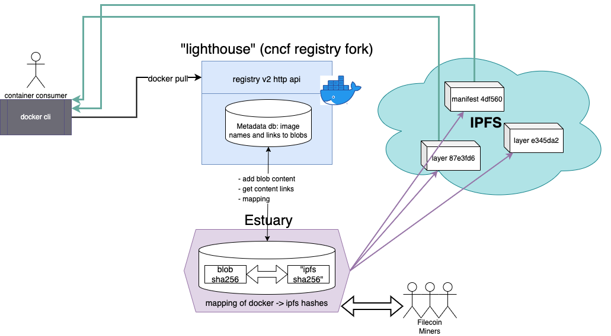

# Lighthouse, a Decentralized Docker Registry

The toolset to pack, ship, store, and deliver container images over IPFS / Filecoin via Estuary.

This repository's main product is the Open Source Registry implementation
for storing and distributing container images using the
[OCI Distribution Specification](https://github.com/opencontainers/distribution-spec).
The goal of this project is to provide a simple, secure, and scalable base
for building a large scale registry solution or running a simple private registry.
It is a core library for many registry operators including Docker Hub, GitHub Container Registry,
GitLab Container Registry and DigitalOcean Container Registry, as well as the CNCF Harbor
Project, and VMware Harbor Registry.



### Build and Run lighthouse registry

1. Build the binary

```bash
$ make
```

2. Setup Config file (config.yml)

```yaml
version: 0.1
log:
  fields:
    service: registry

storage:
  redirect:
    disable: false
  
  estuary:
    url: https://api.estuary.tech
    shuttle-url: https://shuttle-4.estuary.tech
    auth-token: TOKEN_GOES_HERE
    rootdirectory: /Users/satoshi/registries/estuary-prod

http:
  addr: :5005
  headers:
    X-Content-Type-Options: [nosniff]
health:
  storagedriver:
    enabled: true
    interval: 10s
    threshold: 3

```

3. Run the service

```
$ bin/registry serve config.yml
WARN[0000] No HTTP secret provided - generated random secret. This may cause problems with uploads if multiple registries are behind a load-balancer. To provide a shared secret, fill in http.secret in the configuration file or set the REGISTRY_HTTP_SECRET environment variable.  go.version=go1.17.3 instance.id=fa0b0fca-3f04-41ac-8f95-02be502e8672 service=registry version=v2.7.0-1983-gefbad67e.m
INFO[0000] redis not configured                          go.version=go1.17.3 instance.id=fa0b0fca-3f04-41ac-8f95-02be502e8672 service=registry version=v2.7.0-1983-gefbad67e.m
INFO[0000] Starting upload purge in 17m0s                go.version=go1.17.3 instance.id=fa0b0fca-3f04-41ac-8f95-02be502e8672 service=registry version=v2.7.0-1983-gefbad67e.m
INFO[0000] listening on [::]:5005                        go.version=go1.17.3 instance.id=fa0b0fca-3f04-41ac-8f95-02be502e8672 service=registry version=v2.7.0-1983-gefbad67e.m
...
```

#### Configure 

- Create `Dockerfile`:

    ```dockerfile
    FROM busybox:latest
    CMD echo 'hello world'
    ```

- Build Docker image:

    ```bash
    $ docker build -t example/helloworld .
    ```

    Test run:

    ```bash
    $ docker run example/helloworld:latest
    hello world
    ```

    Tag and push
    ```
    $ docker tag example/helloworld 127.0.0.1:5005/helloworld:v1
    $ docker push 127.0.0.1:5005/helloworld:v1
    The push refers to repository [127.0.0.1:5005/helloworld]
    eb6b01329ebe: Pushed 
    v1: digest: sha256:8c061639004b9506a38e11fad10ce1a6270207e80c4a50858fa22cd2c115b955 size: 526
    ```
    
- Pull image from lighthouse registry
    ```bash
    $ docker pull 127.0.0.1:5005/helloworld:v1
    v1: Pulling from helloworld
    Digest: sha256:8c061639004b9506a38e11fad10ce1a6270207e80c4a50858fa22cd2c115b955
    Status: Image is up to date for 127.0.0.1:5005/helloworld:v1
    ```

- Run image pulled from Lighthouse:

    ```bash
    $ docker run 127.0.0.1:5005/helloworld:v1
    hello world
    ```

### Transferring images from dockerhub to registry

Included is a helper script to move all tagged images from dockerhub, quay.io, etc. to the lighthouse
decentralized registry.

Below is an example call to pull and transfer all tagged alpine images

```
$ script/migrateimages alpine 127.0.0.1:5005
```


[](https://github.com/distribution/distribution/actions?query=workflow%3ACI)
[](https://pkg.go.dev/github.com/distribution/distribution)
[](LICENSE)
[](https://codecov.io/gh/distribution/distribution)
[](https://app.fossa.com/projects/custom%2B162%2Fgithub.com%2Fdistribution%2Fdistribution?ref=badge_shield)
[](https://github.com/distribution/distribution/actions?query=workflow%3Aconformance)

This repository contains the following components:

|**Component**       |Description                                                                                                                                                                                         |
|--------------------|----------------------------------------------------------------------------------------------------------------------------------------------------------------------------------------------------|
| **registry**       | An implementation of the [OCI Distribution Specification](https://github.com/opencontainers/distribution-spec).                                                                                                 |
| **libraries**      | A rich set of libraries for interacting with distribution components. Please see [godoc](https://pkg.go.dev/github.com/distribution/distribution) for details. **Note**: The interfaces for these libraries are **unstable**. |
| **documentation**  | Docker's full documentation set is available at [docs.docker.com](https://docs.docker.com). This repository [contains the subset](docs/) related just to the registry.                                                                                                                                          |

### How does this integrate with Docker, containerd, and other OCI client?

Clients implement against the OCI specification and communicate with the
registry using HTTP. This project contains a client implementation which
is currently in use by Docker, however, it is deprecated for the
[implementation in containerd](https://github.com/containerd/containerd/tree/master/remotes/docker)
and will not support new features.

### What are the long term goals of the Distribution project?

The _Distribution_ project has the further long term goal of providing a
secure tool chain for distributing content. The specifications, APIs and tools
should be as useful with Docker as they are without.

Our goal is to design a professional grade and extensible content distribution
system that allow users to:

* Enjoy an efficient, secured and reliable way to store, manage, package and
  exchange content
* Hack/roll their own on top of healthy open-source components
* Implement their own home made solution through good specs, and solid
  extensions mechanism.

## Contribution

Please see [CONTRIBUTING.md](CONTRIBUTING.md) for details on how to contribute
issues, fixes, and patches to this project. If you are contributing code, see
the instructions for [building a development environment](BUILDING.md).

## Communication

For async communication and long running discussions please use issues and pull requests on the github repo.
This will be the best place to discuss design and implementation.

For sync communication we have a #distribution channel in the [CNCF Slack](https://slack.cncf.io/)
that everyone is welcome to join and chat about development.

## Licenses

The distribution codebase is released under the [Apache 2.0 license](LICENSE).
The README.md file, and files in the "docs" folder are licensed under the
Creative Commons Attribution 4.0 International License. You may obtain a
copy of the license, titled CC-BY-4.0, at http://creativecommons.org/licenses/by/4.0/.
