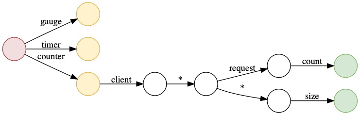

# FSM Mapping

## Overview

This package implements a fast and efficient algorithm for generic glob style
string matching using a finite state machine (FSM).

### Source Hierachy

```
  '-- fsm
      '-- dump.go // functionality to dump the FSM to Dot file
      '-- formatter.go // format glob templates using captured * groups
      '-- fsm.go // manipulating and searching of FSM
      '-- minmax.go // min() max() function for interger
```

## FSM Explained

Per [Wikipedia](https://en.wikipedia.org/wiki/Finite-state_machine):

> A finite-state machine (FSM) or finite-state automaton (FSA, plural: automata),
> finite automaton, or simply a state machine, is a mathematical model of
> computation. It is an abstract machine that can be in exactly one of a finite
> number of states at any given time. The FSM can change from one state to
> another in response to some external inputs; the change from one state to
> another is called a transition. An FSM is defined by a list of its states, its
> initial state, and the conditions for each transition.

In our use case, each *state* is a substring after the input StatsD metric name is splitted by `.`.

### Add state to FSM

`func (f *FSM) AddState(match string, matchMetricType string,
maxPossibleTransitions int, result interface{}) int`

At first, the FSM only contains three states, representing three possible metric types:

           ____ [gauge]
          /
    (start)---- [counter]
          \
           '--- [observer]


Adding a rule `client.*.request.count` with type `counter` will make the FSM to be:


           ____ [gauge]
          /
    (start)---- [counter] -- [client] -- [*] -- [request] -- [count] -- {R1}
          \
           '--- [observer]

`{R1}` is short for result 1, which is the match result for `client.*.request.count`.

Adding a rule `client.*.*.size` with type `counter` will make the FSM to be:

           ____ [gauge]                      __ [request] -- [count] -- {R1}
          /                                 /
    (start)---- [counter] -- [client] -- [*]
          \                                  \__ [*] -- [size] -- {R2}
           '--- [observer]


### Finding a result state in FSM

`func (f *FSM) GetMapping(statsdMetric string, statsdMetricType string)
(*mappingState, []string)`

For example, when mapping `client.aaa.request.count` with `counter` type in the
FSM, the `^1` to `^7` symbols indicate how FSM will traversal in its tree:


           ____ [gauge]                      __ [request] -- [count] -- {R1}
          /                                 /       ^5        ^6         ^7
    (start)---- [counter] -- [client] -- [*]
       ^1 \          ^2           ^3        \__ [*] -- [size] -- {R2}
           '--- [observer]                ^4 


To map `client.bbb.request.size`, FSM will do a backtracking:


           ____ [gauge]                      __ [request] -- [count] -- {R1}
          /                                 /       ^5         ^6
    (start)---- [counter] -- [client] -- [*]
       ^1 \          ^2           ^3        \__ [*] -- [size] -- {R2}
           '--- [observer]                ^4
                                                 ^7      ^8        ^9


## Debugging

To see all the states of the current FSM, use `func (f *FSM) DumpFSM(w io.Writer)`
to dump into a Dot file. The Dot file can be further renderer into image using:

```shell
$ dot -Tpng dump.dot > dump.png
```

In StatsD exporter, one could use the following:

```shell
$ statsd_exporter --statsd.mapping-config=statsd.rules --debug.dump-fsm=dump.dot
$ dot -Tpng dump.dot > dump.png
```

For example, the following rules:

```yaml
mappings:
- match: client.*.request.count
  name: request_count
  match_metric_type: counter
  labels:
    client: $1

- match: client.*.*.size
  name: sizes
  match_metric_type: counter
  labels:
    client: $1
    direction: $2
```

will be rendered as:



The `dot` program is part of [Graphviz](https://www.graphviz.org/) and is
available in most of popular operating systems.
